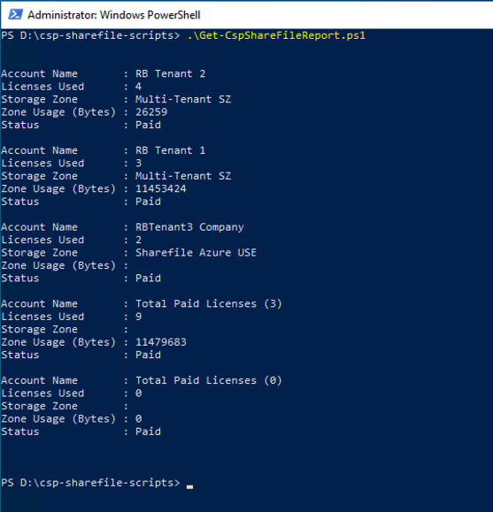
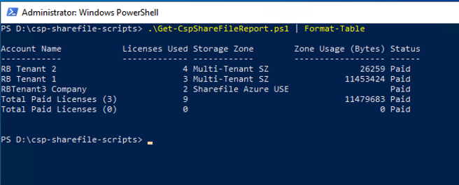

# CSP ShareFile Scripts
## Get-CspShareFileReport.ps1

**Get-CspShareFileReport.ps1** is used to provide a snapshot of ShareFile tenant usage, at the time it is run. It requires a properly formated ShareFile credentials file for opearation, which it will create, if not pre-created by using the **Save-SfCredentialsFile.ps1** script.

If a credentials file is found in the default location (_%HOMEDRIVE%%HOMEPATH%%_) it will attempt to use the credentals stored therein.

**Get-CspShareFileReport.ps1** output an array object, containing summerise details of each ShareFile tenant, and totals for paid and trial licenses used.



This can be piped to **Format-Table** to produce a tablular output.



To export to CSV file, pipe to **Export-Csv**.
```
Get-CspShareFileReport.ps1 | Format-Table | Export-Csv
```

This script requires that the [Citrix ShareFile PowerShell SDK](https://github.com/citrix/ShareFile-PowerShell) be installed. The script attempts to detect if the snapin is installed and registered and will abort of these check fail. The [Citrix Sharefile PowerShell SDK](https://github.com/citrix/ShareFile-PowerShell) can be downloaded from [GitHub](https://github.com/citrix/ShareFile-PowerShell).

The following switch is available:
* **`-File`** which allows the user to specifiy a new path and file name to be created/used.

[back](../README.md)
