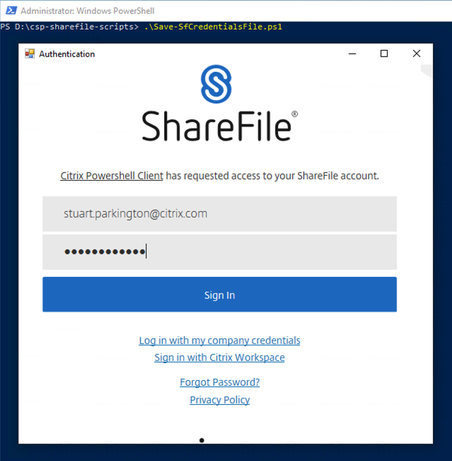
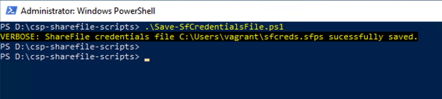

# CSP ShareFile Scripts
## Save-SfCredentialsFile.ps1

**Save-SfCredentialsFile.ps1** will open a ShareFile dialogue box to interactively prompt for user credentials on the required account. 

Without switches, **Save-SfCredentialsFile.ps1** will default to saving a ShareFile credentials file, with the name **`sfcreds.sfps`** to the users home drive/home path (_C:\Users\username_ normally). The **`-File`** can be used to specify an alternative location.

This script requires that the [Citrix ShareFile PowerShell SDK](https://github.com/citrix/ShareFile-PowerShell) be installed. The script attempts to detect if the snapin is installed and registered and will abort of these check fail. The [Citrix Sharefile PowerShell SDK](https://github.com/citrix/ShareFile-PowerShell) can be downloaded from [GitHub](https://github.com/citrix/ShareFile-PowerShell).

The following switch is available:
* **`-File`** which allows the user to specifiy a new path and file name to be created.

[back](../README.md)
